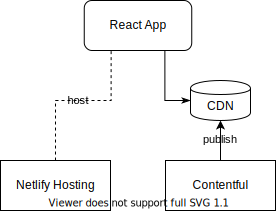
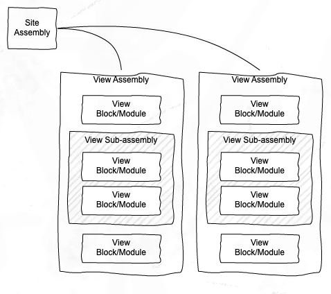

# Overview #

This document is primarily focussed on steps necessary to get the example website up and running.The dominant technologies in use are [React's Material-UI](https://material-ui.com) framework, 
[Contentful CMS](https://www.contentful.com), and [Netlify](https://www.netlify.com) hosting platform.

_N.B. Diagrams are editable (draw.io) SVG files located in `/docs`_

## Getting Started ##

Getting started as a developer is as simple as cloning the repository locally and running in any IDE that supports Javascript web development. The most commonly used IDE has been VS Code.

### Initialise the project ###

1. Clone this repository 
2. Run `yarn install` to install required node packages (Make sure you use Yarn instead of Npm)
3. Run `yarn start` to start the development server and launch the site in a browser

### Contentful ###

1. Get a free Contentful account from [Contentful CMS](https://www.contentful.com)
2. Paste your spaceID to the `config.js` file
3. Create your second environment called dev so that there're two environments master (default), and dev respectively. 
4. Add a new API key for dev environment in Contentful and then assign the content delivery and preview tokens to the following vars respectively on your local machine (I'm using Mac as an example):
   `export REACT_APP_CF_DELIVERY_TOKEN='Your dev delivery token'`
   `export REACT_APP_CF_PREVIEW_TOKEN='Your dev preview token'`
5. Update locales to `en-nz` for the two environments (You can change it later on once you import the config files in).
6. Install Contentful CLI and check how to import content [Contentful CLI](https://www.contentful.com/developers/docs/tutorials/cli/import-and-export/).
7. Import `./contentful.json` into both master and dev environments. The file has included all configurations you need for building a new Contentful. Ps: the `contentful.json`can be deleted once you complete the importation.

**Now, you should be able to see content when running the project from your local server and start doing your development. Let's move on...**

### Netlify ###

1. Get a free Netlify account from [Netlify](https://www.netlify.com)
2. Add a new site by linking your project repository platform(e.g. Github, Bitbucket, etc) with Netlify
3. Under `Build & deploy` settings, set up two environment variables for `REACT_APP_CF_DELIVERY_TOKEN` and `REACT_APP_CF_PREVIEW_TOKEN`,respectively. The tokens value can be found from your API key of master environment in Contentful.

**Woohoo, your project is live and hosted on Netlify!**

--------------------------------------------------------

# Want to learn more? Keep reading the below content otherwise enjoy playing around with the project #

## Contentful

We are using Conteful's Content Delivery API (CDA) to pull published content from Contentful's CDN and surface it within the 
website. The API is integrated using custom hooks and a store provider. For example,

`const { contentStore } = useStore();`

Content structure follows a pattern of [topics and assemblies](https://www.contentful.com/help/topics-and-assemblies/). A page is built using  from an `Assembly` content type, adding blocks that are either sub-assemblies or other content types such as `Snippet` or `Article`. The `Site Root` assembly is used to bootstrap the site.

We also use Contentful to manage site "microcopy" resources. See the `Footer` component for an example of this approach.

Typically, this refers to text-based resources that might otherwise have been hard-coded, like button labels, menu items, etc..

## Netlify

Deployments are managed by Netlify's CI/CD pipeline (not Bitbucket pipelines) and recommended to be triggered by a merge to the `release/production` branch by a Netlify webhook in Bitbucket.

Netlify's [deployment history](https://app.netlify.com/sites/cop-develop/deploys) can be used to rollback to a previous build if needed.

## Code

### Netlify CI/CD

Netlify runs the relevant build script in `package.json` and subsequently deploys the `public/` folder. Environment variables are stored in Netlify.

## Content Publishing

Contentful is published to the environment it has been created for. Content can be migrated between environments using [Contentful's migration tools](https://github.com/contentful/contentful-migration/blob/master/README.md#reference-documentation).

# Quality Assurance

### Code Linting

This project uses a number of code linting plugins for React, React Hooks, and accessibility. Be sure to check no problems are reported before committing changes. 

Netlify CD pipeline also uses an accessibility linting plugin during the build process. Errors are reported in the deployment log.

### Tests

The project uses Jest and [React Testing Library](https://reactjs.org/docs/testing-recipes.html) for unit tests and [Cypress](https://www.cypress.io) integration tests.

#### Unit tests
Tests are located alongside their component, in the same directory. 

#### Integration tests
Integration tests are located in the /cypress directory.

 To run them:
  1. Start the application in one console — `yarn start`
  2. Run Cypress in another one — `yarn cy:open` (-> `yarn run cypress open`)

Test results will be shown in the console. These results can also be found in the `cypress/videos` and `cypress/screenshots` folders.

Further reading: 
  - https://docs.cypress.io/guides/core-concepts/introduction-to-cypress.html
  - https://docs.cypress.io/guides/references/best-practices.html
